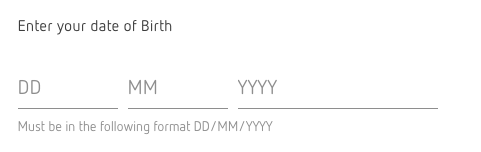
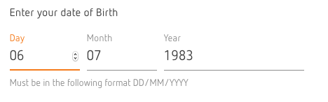

# React Component Exercise

Create a reusable React component based on the date picker designs below.

Tips
----
- Set-up your project as you normally would with React. If you use `create-react-app` or a custom set-up that's fine
- Put your code on Github either as a repo or a gist
- If you like to use automated testing for components then add this too
- As part of your submission provide a URL where we can see the component in the browser on line.

Questions
---------
- Should we provide CSS? If so do we give any instructions on how to use it?
- Do we need to specific about it being one input field?
- Do we want to see validation on the component?
- Do we want to be specific about the behavior with tabbing?
- Should we provide the sketch file and/or a gif too
